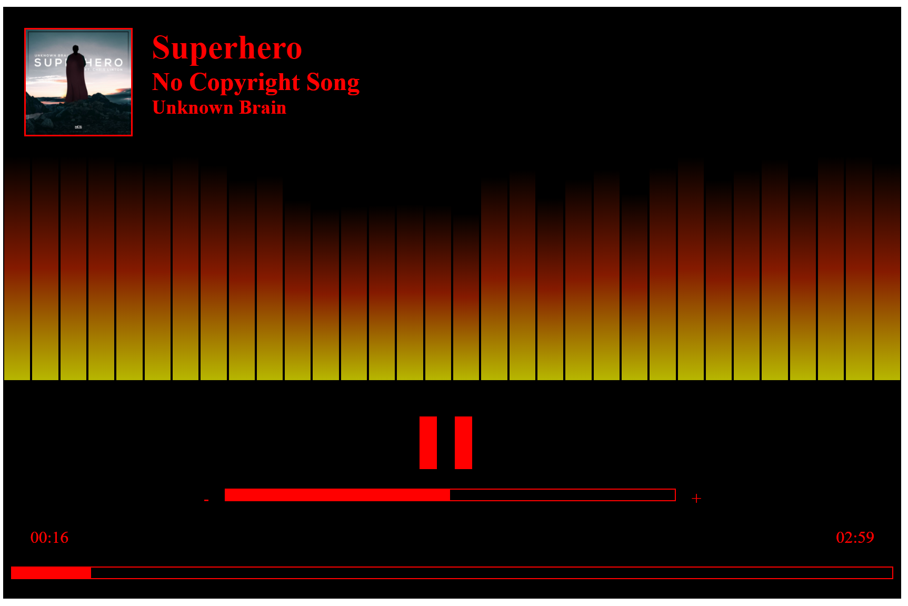
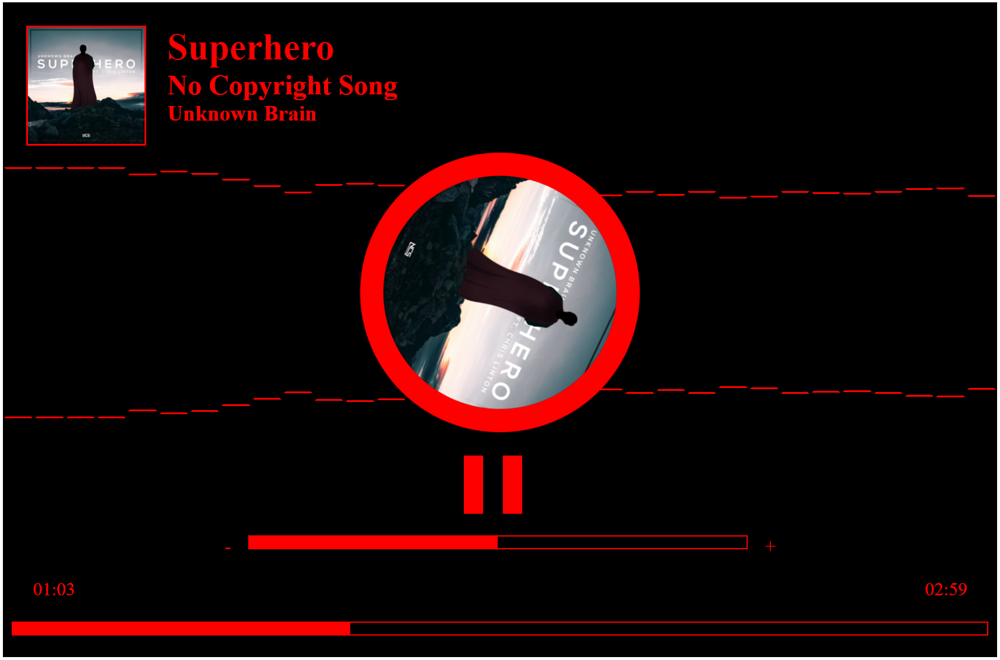

# Ng-Openaudio

Openaudio is an Angular library component developped to manipulate audio source and visualize the sound. Openaudio uses flexbox, it's responsive no matter the height and width of the device.
This project was generated with [Angular CLI](https://github.com/angular/angular-cli) version 8.3.19.

# NPM

You can integrate openaudio in your project using `npm i ng-openaudio --save`. For more documentation about openaudio check out the readme in the projects/openaudio folder or directly on the npm openaudio page https://www.npmjs.com/package/ng-openaudio.

# Demo OpenAudio

[Demo page](./demo/index.html)

Clone this repo and run `ng serve` for a dev server. Navigate to `http://localhost:4200/`. The app will automatically reload if you change any of the source files. You can then test the openaudio library demo.

# License

This project is under the MIT license.

# Author(s)

[RLoris](https://github.com/RLoris)